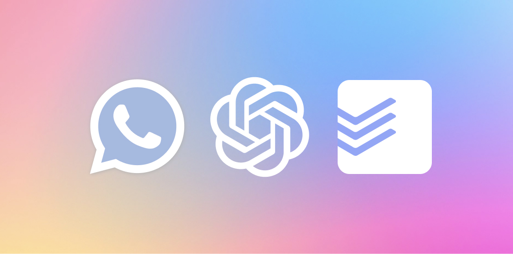

# JarvisBot 🤖



An AI-powered WhatsApp personal assistant that handles voice commands, task management, portfolio tracking, and fund monitoring. Built with **Z-API** for reliable WhatsApp integration and deployed on **Cloudflare Workers**.

## 🆓 Why JarvisBot?

Most AI assistants are expensive or limited. JarvisBot offers:
- **Reliable WhatsApp Integration** - Z-API for stable connections
- **Serverless Architecture** - Cloudflare Workers (free tier)
- **Open Source** - Full transparency and control
- **Multi-modal** - Voice, text, portfolio tracking, and more

## 🎯 Features

### 🎙️ Voice Assistant
- **Voice to Task**: Send audio → AI creates Todoist tasks
- **Voice to Note**: Send audio → AI saves to Obsidian vault
- **Smart Classification**: AI distinguishes between tasks and notes
- **Smart Parsing**: Extracts dates, priorities, and labels

### 📊 Portfolio Tracking
- **Stock Portfolio**: Track Brazilian and US stocks (BDRs)
- **Fund Monitoring**: Track investment funds via CNPJ
- **Daily Reports**: Automated portfolio performance updates
- **Voice Commands**: "Meu portfolio", "Como estão meus fundos?"

### 📝 Note Management  
- **Obsidian Integration**: Notes saved directly to your vault
- **Plugin Sync**: Use the [Jarvis Obsidian Sync](https://github.com/thalysguimaraes/jarvis-obsidian-sync) plugin for seamless vault integration
- **GitHub Sync**: Version control for your notes
- **Daily/Individual**: Flexible note organization

### 🔒 Privacy & Security
- **Webhook-based**: No persistent connections needed
- **Environment Variables**: All secrets configurable
- **Open Source**: Fully auditable code

## 🏗️ Architecture

### Enterprise-Grade Architecture (v3)

JarvisBot v3 features enterprise-grade architecture with resilience patterns, performance optimizations, and advanced monitoring:

```
┌─────────────────┐     ┌──────────────────┐     ┌─────────────────┐
│                 │     │                  │     │                 │
│  WhatsApp App   │────▶│     Z-API        │────▶│ Cloudflare      │
│                 │     │   (WhatsApp      │     │ Worker          │
└─────────────────┘     │   Business API)  │     │ (JarvisBot)     │
                        └──────────────────┘     └─────────────────┘
                                │                          │
                                ▼                          ▼
                        ┌──────────────────┐     ┌─────────────────┐
                        │ CompositeRouter  │     │ Domain Modules: │
                        │ • Auth Middleware│     │ • Audio         │
                        │ • Validation     │     │ • Notes         │
                        │ • Rate Limiting  │     │ • Portfolio     │
                        │ • Error Handling│     │ • Funds         │
                        └──────────────────┘     └─────────────────┘
                                │                          │
                                ▼                          ▼
                        ┌──────────────────┐     ┌─────────────────┐
                        │ Event Bus System │     │ Core Services:  │
                        │ • Typed Events   │     │ • Messaging     │
                        │ • Async Handlers │     │ • Storage       │
                        │ • Concurrent Ops │     │ • AI Service    │
                        └──────────────────┘     │ • Config        │
                                                  └─────────────────┘
```

### Key Architectural Features

#### 🛡️ Resilience Patterns
- **Circuit Breakers**: Prevent cascading failures with automatic recovery
- **Retry Logic**: Exponential backoff with jitter for transient failures
- **Rate Limiting**: Token bucket algorithm to respect API limits
- **Health Checks**: Automated service monitoring and recovery

#### ⚡ Performance Optimizations
- **Request Caching**: In-memory cache with TTL and LRU eviction
- **Connection Pooling**: HTTP keep-alive connections for API efficiency
- **KV Storage Optimization**: Batch operations, compression, and caching
- **Concurrent Event Processing**: Parallel event handling with backpressure

#### 🎯 Advanced Features
- **Feature Flags**: Runtime toggles with gradual rollout and A/B testing
- **Dependency Injection**: Decorator-based DI with automatic service resolution
- **Type-Safe Events**: Discriminated unions with Zod validation
- **Domain Error Handling**: Recovery strategies and retry policies per domain

#### 📊 Core Components
- **CompositeApiRouter**: Modular routing with domain-specific routers
- **Middleware Stack**: Auth, validation, rate limiting, error handling
- **TypedEventBus**: Type-safe concurrent event system
- **ServiceFactoryV2**: Enhanced DI with resilience patterns
- **ResilienceManager**: Centralized resilience configuration

## 📁 Project Structure

```
src/
├── core/                     # Core infrastructure
│   ├── api/                 # API routing and middleware
│   │   ├── routers/         # Domain-specific routers
│   │   └── middleware/      # Request processing middleware
│   ├── cache/               # Caching system with TTL
│   ├── config/              # Configuration management
│   ├── decorators/          # TypeScript decorators for DI
│   ├── errors/              # Error handling system
│   ├── event-bus/           # Event-driven communication
│   ├── features/            # Feature flags system
│   ├── http/                # Connection pooling
│   ├── logging/             # Logging infrastructure
│   ├── modules/             # Module management
│   ├── scheduler/           # Task scheduling
│   └── services/            # Core services
│       ├── ai/              # AI service integration
│       ├── health/          # Health check service
│       ├── messaging/       # WhatsApp messaging
│       ├── resilience/      # Circuit breakers, retry logic
│       └── storage/         # Optimized KV storage
├── domains/                  # Business domain modules
│   ├── audio-processing/    # Voice message handling
│   ├── fund-management/     # Investment fund tracking
│   ├── notes/              # Note-taking and Obsidian sync
│   └── portfolio/          # Stock portfolio management
└── index.ts                 # Main entry point
```

## 🚀 Quick Start

### Prerequisites

- Cloudflare account (free tier works)
- Z-API account and WhatsApp Business number
- OpenAI API key
- Todoist API token (optional)

### 1. Clone and Setup

```bash
git clone https://github.com/yourusername/jarvis-bot.git
cd jarvis-bot
npm install
```

### 2. Configure Environment

```bash
# Copy example configuration
cp .dev.vars.example .dev.vars

# Edit .dev.vars with your configuration
nano .dev.vars
```

### 3. Setup Z-API

1. Go to [Z-API](https://z-api.io/) and create an account
2. Create a WhatsApp Business instance
3. Get your instance credentials:
   - Instance ID
   - Instance Token  
   - Security Token
4. Configure webhook URL (you'll get this after deployment)

### 4. Deploy Worker

```bash
# Login to Cloudflare
npx wrangler login

# Deploy
npm run deploy
```

### 5. Configure Z-API Webhook

1. In Z-API dashboard, set webhook URL to: `https://your-worker.workers.dev/webhook`
2. Enable webhook for message events
3. Test by sending a voice message to your WhatsApp Business number

## ⚙️ Configuration

### Core Configuration (.dev.vars)

```env
# Core Settings
WEBHOOK_SECRET=your-secret-key
OPENAI_API_KEY=sk-your-openai-key

# Z-API WhatsApp Integration
Z_API_INSTANCE_ID=your-z-api-instance-id
Z_API_INSTANCE_TOKEN=your-z-api-instance-token
Z_API_SECURITY_TOKEN=your-z-api-security-token

# Task Management (Optional)
TODOIST_API_TOKEN=your-todoist-token

# Voice Classification  
CLASSIFICATION_ENABLED=true
CLASSIFICATION_CONFIDENCE_THRESHOLD=0.8

# Obsidian Integration (Optional)
OBSIDIAN_STORAGE_TYPE=github
GITHUB_TOKEN=your-github-token
GITHUB_OWNER=your-username
GITHUB_REPO=your-obsidian-vault
OBSIDIAN_VAULT_PATH=.
OBSIDIAN_NOTE_FORMAT=daily
OBSIDIAN_NOTE_PATH=WhatsApp Notes
```

### Portfolio Configuration

```env
# Stock Portfolio (JSON format)
PORTFOLIO_DATA='[
  {"ticker":"AAPL34","shares":100,"avgPrice":50.0},
  {"ticker":"VALE3","shares":500,"avgPrice":60.0}
]'

# Fund Portfolio (JSON format) 
FUND_PORTFOLIO_DATA='[
  {
    "cnpj":"00.000.000/0001-00",
    "name":"Example Fund",
    "quotas":100,
    "investedAmount":10000,
    "avgPrice":100.0,
    "purchaseDate":"2024-01-15"
  }
]'

# Portfolio APIs
BRAPI_TOKEN=your-brapi-token
ZAISEN_API_URL=your-fund-api-url
ZAISEN_API_KEY=your-fund-api-key

# Notifications (WhatsApp number for reports)
PORTFOLIO_WHATSAPP_NUMBER=5511999999999
```

## 🎤 Voice Commands

### Task Management
- **"Comprar leite amanhã"** → Creates Todoist task for tomorrow
- **"Urgente: enviar relatório até sexta"** → High priority task due Friday
- **"Reunião com cliente segunda 14h"** → Task with specific date/time

### Note Taking
- **"Tive uma ideia para melhorar vendas"** → Saves as Obsidian note
- **"Cliente prefere reuniões de manhã"** → Classified as note, not task

### Portfolio Commands
- **"Meu portfolio"** → Full portfolio report
- **"Como está a AAPL34?"** → Specific stock performance
- **"Meus fundos"** → Fund portfolio status
- **"Cota do fundo Trend"** → Specific fund quote

## 📊 Portfolio Features

### Supported Markets
- **Brazilian Stocks**: B3 listed companies (VALE3, PETR4, etc.)
- **US BDRs**: Brazilian Depositary Receipts (AAPL34, MSFT34, etc.)
- **Investment Funds**: Brazilian funds tracked by CNPJ

### Automated Reports
- Daily portfolio performance (weekdays 6 PM BRT)
- Weekend summaries
- Real-time quote updates
- Performance calculations with purchase prices

### Voice Integration
Ask about your investments naturally in Portuguese:
- "Como estão minhas ações?"
- "Qual o rendimento hoje?"
- "Fundos subiram ou desceram?"

## 🔧 Deployment Options

### Cloudflare Workers (Recommended)
```bash
# Deploy to production
npm run deploy

# Monitor logs
npx wrangler tail
```

### Local Development
```bash
# Run locally
npm run dev

# Test endpoints
curl http://localhost:8787/health
```

## 🔐 Security Best Practices

### Environment Variables
- Store all secrets in Cloudflare Worker secrets
- Use `.dev.vars` for local development only
- Never commit secrets to Git

### Z-API Security
- Use webhook authentication via security token
- Validate all incoming webhook requests
- Monitor for unusual API usage

### API Security
- All external API calls use HTTPS
- Rate limiting on webhook endpoints
- Input validation for all user content

## 💰 Cost Breakdown

| Service | Cost | Notes |
|---------|------|-------|
| Cloudflare Workers | Free | 100k requests/day limit |
| Z-API | $15-30/month | WhatsApp Business API |
| OpenAI Transcription | ~$0.006/min | Pay per use |
| **Total** | **$15-30/month** | + minimal OpenAI usage |

## 🛠️ Development

### Project Structure
```
src/
├── index.ts                 # Main worker entry point
├── modules/
│   ├── classification/      # AI voice classification
│   ├── portfolio-tracker/   # Stock portfolio management
│   ├── fund-tracker/       # Investment fund tracking  
│   ├── todoist/            # Task management
│   └── obsidian/           # Note management
├── router/                 # Request routing
└── utils/                  # Shared utilities
```

### Build Commands
```bash
npm run build        # Type check and build
npm run typecheck    # TypeScript validation
npm run lint         # Code linting
npm run deploy       # Deploy to Cloudflare
```

### Testing
```bash
# Test worker health
curl https://your-worker.workers.dev/health

# Test webhook endpoint
curl -X POST https://your-worker.workers.dev/test-webhook

# Test portfolio
curl -X POST https://your-worker.workers.dev/test-portfolio
```

## 🔍 Troubleshooting

### Common Issues

**Webhook Not Receiving Messages**
- Check Z-API webhook URL is correct
- Verify security token matches `WEBHOOK_SECRET`
- Check Cloudflare Worker logs: `npx wrangler tail`

**Messages Not Processing**  
- Verify OpenAI API key is valid
- Check audio format is supported
- Monitor worker execution time limits

**Portfolio Not Updating**
- Check BRAPI_TOKEN is valid
- Verify ticker symbols in PORTFOLIO_DATA
- Ensure fund API credentials are correct

**Classification Issues**
- Adjust `CLASSIFICATION_CONFIDENCE_THRESHOLD`
- Check voice message quality and language
- Review classification logs in worker

### Debug Commands

```bash
# Check worker logs
npx wrangler tail

# Test configuration
curl https://your-worker.workers.dev/test-config

# Check status
curl https://your-worker.workers.dev/status
```

## 🔗 Integrations & Plugins

### Obsidian Plugin

For seamless note management, use the companion [**Jarvis Obsidian Sync**](https://github.com/thalysguimaraes/jarvis-obsidian-sync) plugin:

- 🎤 **Automatic Sync**: Voice notes sync directly to your Obsidian vault
- ⚡ **Real-time**: Configurable auto-sync intervals
- 📁 **Smart Organization**: Custom folders and naming patterns
- 🔒 **Secure**: API key authentication
- 📝 **Rich Formatting**: Notes include timestamps and metadata

**Quick Setup:**
1. Install the plugin in Obsidian
2. Configure with your Jarvis Bot URL and API key (set `OBSIDIAN_API_KEY` in your environment)
3. Choose your sync preferences

## 🤝 Contributing

Contributions welcome! Areas for improvement:

- **Language Support**: Add English/Spanish voice commands
- **New Integrations**: More task managers, note apps
- **Market Support**: International stock markets
- **Analytics**: Usage tracking and insights
- **Voice Responses**: Text-to-speech replies

### Development Setup
1. Fork the repository
2. Create feature branch: `git checkout -b feature-name`
3. Make changes and test locally
4. Submit pull request with description

## 📄 Legal & Disclaimer

This project uses third-party services and APIs:

- **Z-API**: For WhatsApp Business API access
- **OpenAI**: For voice transcription services  
- **Market APIs**: For real-time financial data
- **Todoist**: For task management integration

**Not affiliated with**: WhatsApp Inc., Meta Platforms, OpenAI, Todoist, or any mentioned services.

Use at your own risk. Ensure compliance with WhatsApp Business API Terms of Service.

## 📜 License

ISC License - See LICENSE file for details

---

## 🆘 Support

- **Documentation**: Check this README and inline code comments
- **Issues**: Open GitHub issue for bugs or feature requests  
- **Discussions**: Use GitHub Discussions for questions

---

*Built with ❤️ for personal productivity and financial awareness*
